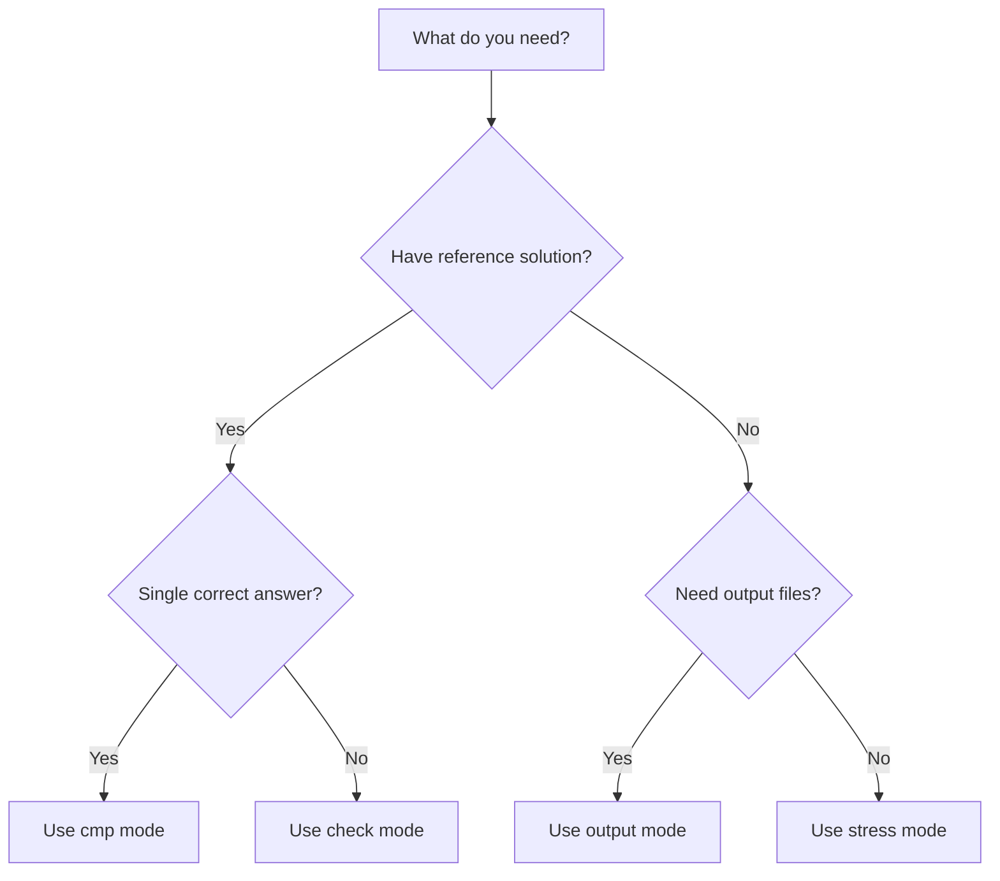

## Overview

Quick Test CLI provides four specialized test modes, each designed for different testing scenarios in competitive programming. Choose the appropriate mode based on your testing requirements.

## Mode comparison

<CardGroup cols={2}>
  <Card title="cmp" icon="code-compare">
    Compare your solution against a correct brute-force implementation
  </Card>
  
  <Card title="stress" icon="gauge-high">
    Test execution time and performance without output comparison
  </Card>
  
  <Card title="check" icon="circle-check">
    Validate solutions with multiple correct answers using a custom checker
  </Card>
  
  <Card title="output" icon="file-export">
    Generate output files for pre-existing test cases
  </Card>
</CardGroup>

---

## cmp mode

The `cmp` mode verifies the correctness of your solution by comparing it against a brute-force reference implementation. The reference solution should be correct but can be slower.

### When to use

- You have a correct but slow brute-force solution
- You want to verify that your optimized solution produces the same output
- The problem has a unique correct answer

### Required files

<Steps>
  <Step title="Target file">
    Your optimized solution that you want to test (`--target-file` or `-t`)
  </Step>
  
  <Step title="Correct file">
    A brute-force solution that is guaranteed to be correct (`--correct-file` or `-c`)
  </Step>
  
  <Step title="Generator or prefix">
    Either a test case generator (`--gen-file` or `-g`) OR a file prefix for existing test cases (`--prefix` or `-p`)
  </Step>
</Steps>

### Usage example

<CodeGroup>
```bash Full command
quicktest cmp --target-file=main.cpp --correct-file=correct.cpp --gen-file=gen.cpp --test-cases=1000 --timeout=2000
```

```bash Short form
qt cmp -t main.cpp -c correct.cpp -g gen.cpp --tc 1000 --tout 2000
```

```bash With prefix
qt cmp -t main.cpp -c correct.cpp -p testcase_ac
```
</CodeGroup>

### Additional options

<Accordion title="--diff flag">
  The `--diff` or `-d` flag shows detailed differences between your output and the expected output when a wrong answer is detected.
  
  ```bash
  qt cmp -t main.cpp -c correct.cpp -g gen.cpp --diff
  ```
</Accordion>

### How it works

1. Compiles both target and correct files
2. Generates a test case (or loads from prefix)
3. Runs both solutions with the same input
4. Compares the outputs character by character
5. Reports verdict: AC if outputs match, WA if they differ, or TLE/RTE/MLE if limits are exceeded

<Info>
Both your target file and correct file must complete within the timeout limit. If the correct file exceeds the time limit, you'll see a TLE message for the correct solution.
</Info>

---

## stress mode

The `stress` mode focuses on performance testing by running your solution against multiple test cases without comparing outputs. It verifies that your code executes within time and memory limits.

### When to use

- You want to test if your solution runs within time limits
- You don't have a reference solution to compare against
- You're testing for runtime errors or crashes
- You're benchmarking performance across many test cases

### Required files

<Steps>
  <Step title="Target file">
    Your solution to test (`--target-file` or `-t`)
  </Step>
  
  <Step title="Generator or prefix">
    Either a test case generator (`--gen-file` or `-g`) OR a file prefix for existing test cases (`--prefix` or `-p`)
  </Step>
</Steps>

### Usage example

<CodeGroup>
```bash Full command
quicktest stress --target-file=main.cpp --gen-file=gen.cpp --test-cases=1000 --timeout=1000
```

```bash Short form
qt stress -t main.cpp -g gen.cpp --tc 1000 --tout 1000
```

```bash With prefix
qt stress -t main.cpp -p test_cases/input --tc 100
```
</CodeGroup>

### How it works

1. Compiles the target file
2. Generates test cases (or loads from prefix)
3. Runs the solution and measures execution time and memory usage
4. Reports verdict: AC if completed successfully within limits, TLE/RTE/MLE otherwise

<Warning>
Stress mode does NOT validate correctness of output. It only checks that your code runs without errors and within resource limits.
</Warning>

<Tip>
Use `--break-bad` to stop testing immediately when a TLE, RTE, or MLE is found:

```bash
qt stress -t main.cpp -g gen.cpp --break
```
</Tip>

---

## check mode

The `check` mode is designed for problems with multiple valid answers. Instead of comparing outputs directly, it uses a custom checker script to validate whether your solution's output is acceptable.

### When to use

- The problem has multiple correct answers (e.g., "find any valid solution")
- Output format needs custom validation logic
- You need to verify constraints beyond exact string matching
- Problems asking for any permutation, any subset, or optimization with multiple optima

### Required files

<Steps>
  <Step title="Target file">
    Your solution to test (`--target-file` or `-t`)
  </Step>
  
  <Step title="Checker file">
    A program that validates whether the output is correct (`--checker-file` or `-c`)
  </Step>
  
  <Step title="Generator or prefix">
    Either a test case generator (`--gen-file` or `-g`) OR a file prefix for existing test cases (`--prefix` or `-p`)
  </Step>
</Steps>

### Usage example

<CodeGroup>
```bash Full command
quicktest check --target-file=main.cpp --checker-file=checker.cpp --gen-file=gen.cpp --test-cases=1000
```

```bash Short form
qt check -t main.cpp -c checker.cpp -g gen.cpp --tc 1000 --tout 2000
```

```bash With prefix
qt check -t main.cpp -c checker.cpp -p testcase
```
</CodeGroup>

### Writing a checker

Your checker program should:

1. Read the test input from the generated test case
2. Read the output produced by your target solution
3. Validate whether the output is correct
4. Exit with code 0 for correct answers, non-zero for wrong answers

<Accordion title="Example checker (C++)">
```cpp
#include <iostream>
#include <fstream>
using namespace std;

int main() {
    // Read input from .qt/input.txt
    ifstream input(".qt/input.txt");
    int n;
    input >> n;
    input.close();
    
    // Read output from .qt/output.txt
    ifstream output(".qt/output.txt");
    int result;
    output >> result;
    output.close();
    
    // Validate the output
    if (result >= 0 && result <= n) {
        return 0; // Accepted
    } else {
        return 1; // Wrong Answer
    }
}
```
</Accordion>

### How it works

1. Compiles target file and checker file
2. Generates a test case (or loads from prefix)
3. Runs the target solution
4. Runs the checker with access to both input and output
5. Reports verdict based on checker's exit code

<Info>
The checker also has a timeout limit. If your checker is complex, make sure it runs efficiently.
</Info>

---

## output mode

The `output` mode runs your solution against existing test cases and generates output files. This is useful for creating expected outputs or preparing submissions.

### When to use

- You want to generate output files for a set of input files
- You need to create expected outputs for test cases
- You're preparing files for manual verification
- You want to batch-process multiple input files

### Required files

<Steps>
  <Step title="Target file">
    Your solution to run (`--target-file` or `-t`)
  </Step>
  
  <Step title="Prefix">
    File prefix for input test cases (`--prefix` or `-p`)
  </Step>
</Steps>

### Usage example

<CodeGroup>
```bash Full command
quicktest output --target-file=main.cpp --prefix=testcase_ac --timeout=2000
```

```bash Short form
qt output -t main.cpp -p test_cases/testcase_ac --tout 2000
```

```bash Save outputs
qt output -t main.cpp -p testcase --save-out
```
</CodeGroup>

### File naming

Quick Test CLI looks for input files matching the pattern:
- `{prefix}_1.in`, `{prefix}_2.in`, `{prefix}_3.in`, ...

With `--save-out`, it creates output files:
- `{prefix}_1.out`, `{prefix}_2.out`, `{prefix}_3.out`, ...

<Accordion title="Example file structure">
```
test_cases/
├── sample_1.in
├── sample_2.in
├── sample_3.in
└── (after running with --save-out)
    ├── sample_1.out
    ├── sample_2.out
    └── sample_3.out
```
</Accordion>

### Additional options

| Option | Description |
|--------|-------------|
| `--save-out` | Save the output for each test case to a `.out` file |
| `--break-bad` | Stop execution if TLE or RTE occurs |

### How it works

1. Compiles the target file
2. Finds all input files matching the prefix pattern
3. Runs the solution for each input file
4. Optionally saves outputs to corresponding `.out` files
5. Reports execution status for each test case

<Warning>
Unlike other modes, `output` mode does NOT use the `--gen-file` option. It requires the `--prefix` option to locate existing input files.
</Warning>

---

## Choosing the right mode

Use this decision tree to select the appropriate test mode:



<CardGroup cols={2}>
  <Card title="Overview" icon="book" href="/concepts/overview">
    Learn about Quick Test CLI's core architecture
  </Card>
  
  <Card title="Usage examples" icon="terminal" href="/guides/examples">
    See detailed usage examples for each mode
  </Card>
</CardGroup>